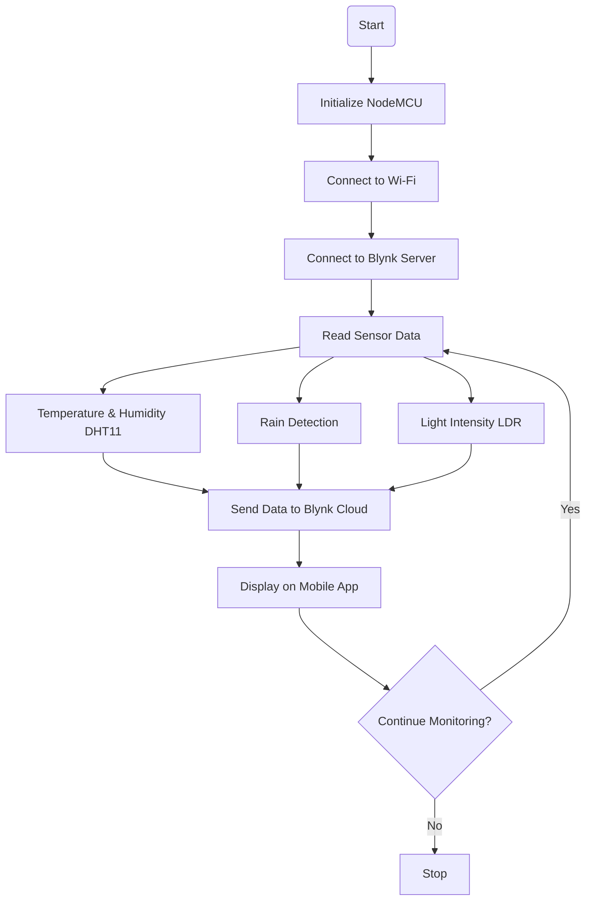

# 🌦️ Weather Monitoring IoT System

## 📌 Overview
This project is a real-time IoT-based Weather Monitoring System that collects environmental data using sensors and displays it remotely on a mobile application.

The system is built using NodeMCU (ESP8266) and integrates:
- DHT11 → Temperature & Humidity  
- Rain Sensor → Rain/Water Detection  
- LDR → Light Intensity Detection  

All sensor data is transmitted over Wi-Fi and visualized using the Blynk mobile app, enabling remote monitoring from anywhere in the world.

---

## 🚀 Features
- 🌡️ Live Temperature Monitoring  
- 💧 Humidity Tracking  
- 🌧️ Rain Detection  
- ☀️ Light Intensity Measurement  
- 📱 Real-time Mobile Dashboard (Blynk)  
- 🌐 Remote Monitoring via Internet  
- 🔔 Instant environmental updates  

---

## 🛠️ Tech Stack

### Hardware
- NodeMCU (ESP8266)
- DHT11 Sensor
- Rain Sensor Module
- LDR Sensor
- Breadboard
- Jumper Wires

### Software
- Arduino IDE
- Blynk Mobile App

### Programming Language
- Embedded C (Arduino IDE)

## ⚙️ System Architecture

Sensors → NodeMCU → Wi-Fi → Blynk Cloud → Mobile App

---

## 🔄 System Flowchart

## ⚙️ Working Principle
- Sensors are connected to NodeMCU using GPIO pins  
- NodeMCU reads data continuously  
- Sends data to Blynk via Wi-Fi  
- Data is shown on mobile app

---

## 📥 Setup Instructions

### 1️⃣ Hardware Setup
- Connect DHT11, Rain Sensor, and LDR to NodeMCU  
- Use breadboard and jumper wires  
- Assign proper GPIO pins for each sensor  

### 2️⃣ Software Setup
- Install Arduino IDE  
- Install ESP8266 board package  
- Install required libraries:
  - Blynk  
  - DHT Sensor  

### 3️⃣ Blynk Setup
- Install Blynk app on Android  
- Create a new project  
- Add widgets:
  - Temperature Gauge  
  - Humidity Gauge  
  - Rain Indicator  
  - Light Intensity Gauge  
- Copy Auth Token from Blynk  

### 4️⃣ Upload Code
- Add Wi-Fi SSID and Password  
- Add Blynk Auth Token  
- Upload code to NodeMCU using Arduino IDE

---

## 📊 Results
- Real-time weather data is successfully displayed on the Blynk mobile app  
- Sensor values update instantly when environmental conditions change  
- System works continuously without manual intervention  
- Remote monitoring is achieved from anywhere using internet connectivity  

---

## ✅ Advantages
- 💰 Low cost implementation  
- 🤖 Fully automated system  
- 🌍 Remote access from anywhere  
- ⚡ Real-time data updates  
- 🔧 Easy to expand with more sensors  
- 📡 No manual monitoring required  

---

## 🌍 Applications
- 🌾 Smart Agriculture  
- 🌦️ Weather Monitoring Stations  
- 🌱 Environmental Monitoring  
- 🏠 Smart Home Systems  
- 🏭 Industrial Monitoring Systems  

---

## 🔮 Future Improvements
- Add CO₂ and air quality sensors  
- Develop web dashboard for analytics  
- Add data logging and history tracking  
- Implement AI-based weather prediction  
- Enable SMS/Email alert system  

---

## 📚 Conclusion
This project demonstrates a smart IoT-based weather monitoring system that enables real-time environmental tracking using sensors and cloud connectivity. It provides an efficient, low-cost, and scalable solution for remote weather monitoring applications.
